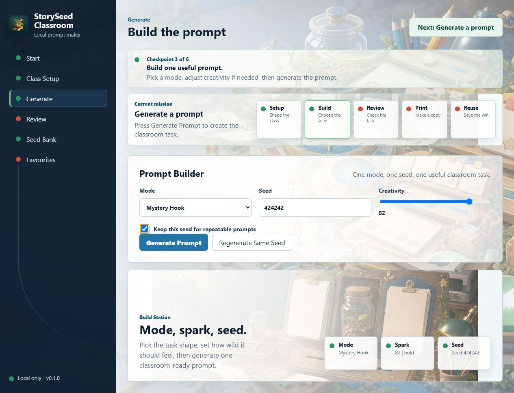
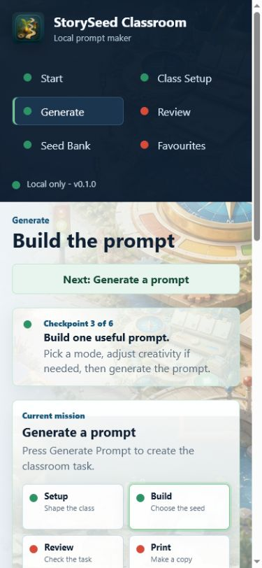
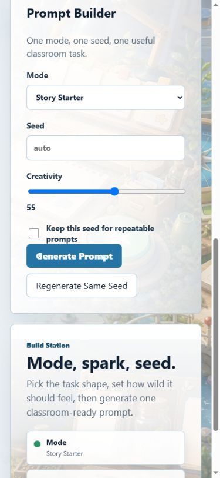

# StorySeed Classroom

StorySeed Classroom is a Windows-simple, local-first classroom prompt generator.
Download the ZIP, unzip it, double-click `START_StorySeed_WINDOWS.bat`, then
press `Generate Prompt`.

It turns safe seed banks into writing, drawing, discussion, vocabulary, mystery,
and invention prompts without API keys, accounts, cloud calls, npm, or a build
step.

[Download the latest release](https://github.com/Martin123132/StorySeedClassroom/releases/latest)



## Start On Windows

1. Open the `StorySeedClassroom` folder.
2. Double-click `START_StorySeed_WINDOWS.bat`.
3. Your browser opens.
4. Press `Generate Prompt`.

If Windows says Python is missing, install Python 3.10 or newer from:

```text
https://www.python.org/downloads/windows/
```

Tick `Add python.exe to PATH` during install, then double-click the launcher
again.

## Screenshots





## Product Shape

- Separate pages: Start, Class Setup, Generate, Review, Seed Bank, Favourites.
- Clickable traffic lights, page-level zone guidance, and the top `Next` button
  guide the next step.
- Sidebar route lights mirror the current checkpoint state on every page.
- A mission strip shows the current command and the setup, build, review, print,
  reuse route without crowding the working page.
- Seed Bank Safety checks edited ingredients and marks them green, amber, or red.
- The Reuse Shelf checkpoint turns green only when a prompt has been saved as a
  favourite.
- A project-owned classroom-world wallpaper gives the app a guided open-world feel
  without relying on cloud assets.
- A mission-lane image turns the top guidance into a classroom route scene rather
  than a generic banner.
- The Favourites page has a guided Reuse Shelf empty state, with its own local
  shelf scene and buttons that move the user back to Generate or Save Current
  Prompt.
- The Generate page has a Prompt Forge station with live mode, creativity, and
  seed readouts, backed by a local build-station image.
- A local StorySeed icon gives the sidebar and browser tab their own classroom
  route identity instead of a generic letter tile.
- The Start page includes a local route-map image with code-native stops for
  setup, build, review, print, and reuse.
- Setup, Generate, Review, Seed Bank, and Favourites use their own local
  world-zone wallpapers, preloaded by the app, so each step feels like a
  different part of the same classroom map.
- Defaults are classroom-safe and kid-friendly.
- Outputs include a student task, challenge, vocabulary, checklist, extension,
  teacher note, and deterministic trace.
- Subject packs shape vocabulary, focus, constraints, and extensions for
  Creative Writing, Science, History, Feelings, Adventure, Silly, and Mystery.
- Exports prompts as TXT or worksheet-style printable HTML with name, date,
  class, student task, checklist, writing lines, and teacher notes.
- Review includes Student View, Teacher Notes, Print Worksheet, and Open Latest
  Worksheet.
- Saves local edits and favourites only on the user's machine.

## Storage

By default, StorySeed uses portable storage beside the app:

```text
StorySeedClassroom\user-data
```

For D-drive development or tester runs, set `STORYSEED_HOME`:

```powershell
New-Item -ItemType Directory -Force -Path D:\Temp, D:\StorySeedClassroomData | Out-Null
$env:TEMP = "D:\Temp"
$env:TMP = "D:\Temp"
$env:STORYSEED_HOME = "D:\StorySeedClassroomData"
python -m storyseed_app.app
```

## Development Checks

From the `StorySeedClassroom` folder:

```powershell
New-Item -ItemType Directory -Force -Path D:\Temp, D:\StorySeedClassroomData | Out-Null
$env:TEMP = "D:\Temp"
$env:TMP = "D:\Temp"
$env:STORYSEED_HOME = "D:\StorySeedClassroomData"
$env:STORYSEED_TEST_TMP = "D:\Temp"
python -m unittest discover -s tests
python -m compileall storyseed_app tests scripts
python scripts\check_assets.py
python scripts\sample_prompts.py --count 12 --matrix
python -m storyseed_app.app --doctor
```

For a no-friends-needed release rehearsal, use the solo gauntlet:

```text
docs/SELF_TEST_GAUNTLET.md
```

## Release ZIP

```powershell
New-Item -ItemType Directory -Force -Path D:\Temp, D:\StorySeedClassroomData, D:\StorySeedVerifyWork | Out-Null
$env:TEMP = "D:\Temp"
$env:TMP = "D:\Temp"
$env:STORYSEED_HOME = "D:\StorySeedClassroomData"
powershell -ExecutionPolicy Bypass -File scripts\make_release_zip.ps1
$zip = (Get-ChildItem dist\StorySeedClassroom-v*.zip | Sort-Object LastWriteTime -Descending | Select-Object -First 1).FullName
powershell -ExecutionPolicy Bypass -File scripts\verify_release_zip.ps1 -ZipPath $zip -WorkRoot D:\StorySeedVerifyWork
```

## Design Promise

The UI should teach by structure. One page, one job, one sensible next step.

## Feedback

StorySeed does not collect telemetry. If this is on GitHub and something breaks,
open an issue and include the prompt seed, mode, age band, subject, creativity
value, and what you clicked before the problem happened.

More detail: [docs/GITHUB_FEEDBACK.md](docs/GITHUB_FEEDBACK.md)

GitHub issue forms are available for bugs, prompt feedback, and feature ideas.

## License

StorySeed Classroom is source-available for personal and non-commercial use under
the [PolyForm Noncommercial License 1.0.0](LICENSE.md).
